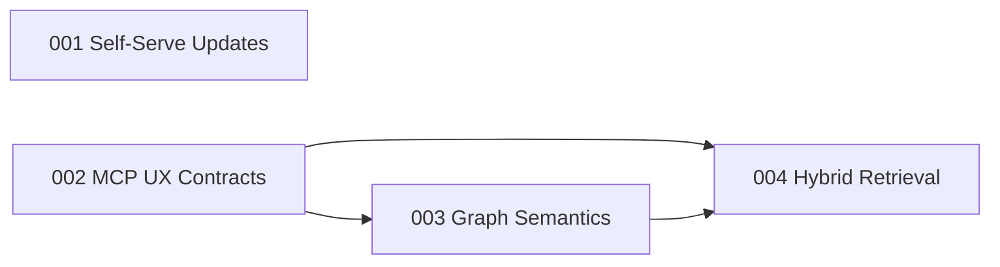

# Specs

## Dependency Graph

## Index

| Spec | Name | State | Depends On |
|------|------|-------|------------|
| [001](001-self-serve-updates/spec.md) | Self-Serve Updates | implementation_complete | — |
| [002](002-mcp-ux-contracts/spec.md) | MCP UX Contracts | planned | — |
| [003](003-graph-semantics-and-governance/spec.md) | Graph Semantics & Governance | planned | 002 |
| [004](004-hybrid-retrieval-and-evals/spec.md) | Hybrid Retrieval & Evals | planned | 002, 003 |
